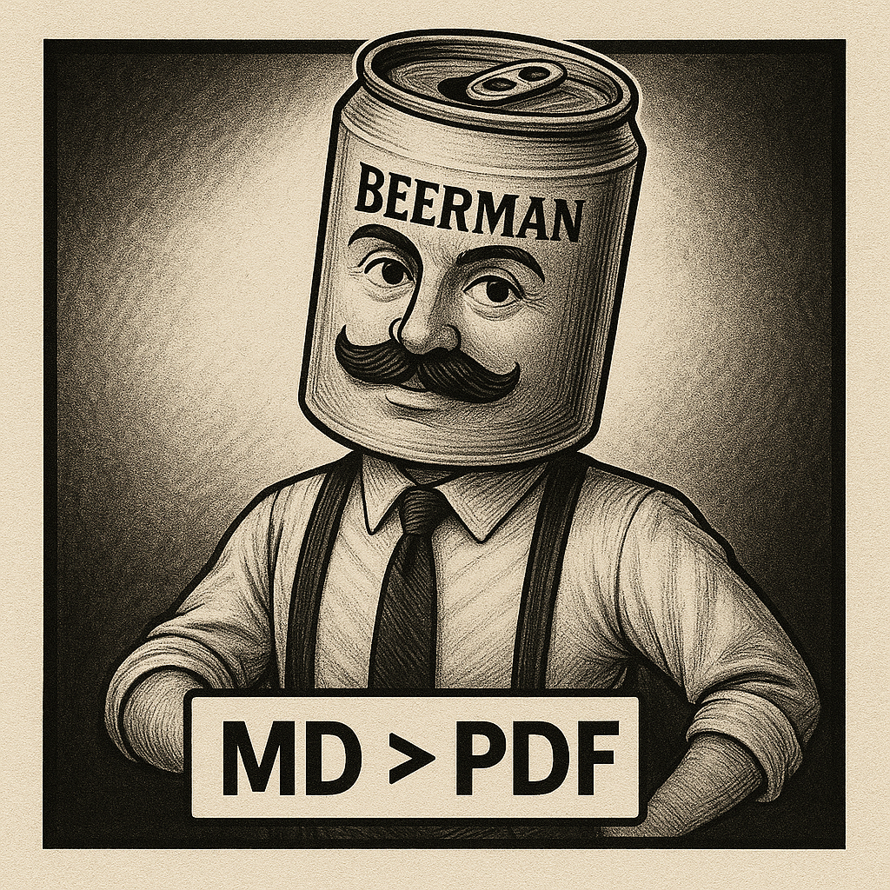
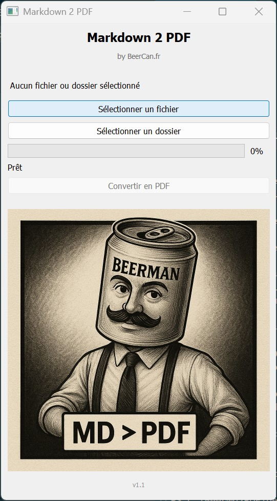

# Markdown 2 PDF

A simple and efficient tool to convert Markdown files to PDF with a user-friendly graphical interface.

<div align="center">
  
</div>

## Application Preview

<div align="center">
  
  <p><em>Markdown 2 PDF - User Interface</em></p>
</div>

## Features

- Convert a single Markdown file to PDF
- Batch conversion of all Markdown files in a folder
- Intuitive graphical interface
- Support for Markdown tables
- Elegant PDF layout

## Requirements

- Python 3.6 or higher
- wkhtmltopdf (must be installed separately)

## Installation

1. Clone this repository:
```bash
git clone https://github.com/your-name/markdown-2-pdf.git
cd markdown-2-pdf
```

2. Install Python dependencies:
```bash
pip install -r requirements.txt
```

3. Install wkhtmltopdf:
   - Windows: [Download installer](https://wkhtmltopdf.org/downloads.html)
   - Linux: `sudo apt-get install wkhtmltopdf`
   - macOS: `brew install wkhtmltopdf`

## Usage

Launch the application:
```bash
python main.py
```

1. Click on "Select a file" or "Select a folder"
2. Choose the Markdown file or folder containing Markdown files
3. Click on "Convert to PDF"
4. PDF files will be generated in the same location as the Markdown files

## Examples

### Table structure support

The Markdown:
```markdown
| Name | Age | City |
|------|-----|------|
| John | 25 | Paris |
| Mary | 30 | Lyon |
```

Will be correctly converted to a table in the generated PDF.

## License

This project is licensed under the MIT License - see the [LICENSE](LICENSE) file for details.

## Author

Developed by [BeerCan.fr](https://beercan.fr)

---

# Version Française

# Markdown 2 PDF

Un outil simple et efficace pour convertir des fichiers Markdown en PDF avec une interface graphique conviviale.


## Fonctionnalités

- Conversion d'un fichier Markdown unique en PDF
- Conversion par lot de tous les fichiers Markdown d'un dossier
- Interface graphique intuitive
- Prise en charge des tableaux Markdown
- Mise en page élégante des PDF générés

## Prérequis

- Python 3.6 ou supérieur
- wkhtmltopdf (doit être installé séparément)

## Installation

1. Clonez ce dépôt :
```bash
git clone https://github.com/votre-nom/markdown-2-pdf.git
cd markdown-2-pdf
```

2. Installez les dépendances Python :
```bash
pip install -r requirements.txt
```

3. Installez wkhtmltopdf :
   - Windows : [Télécharger l'installateur](https://wkhtmltopdf.org/downloads.html)
   - Linux : `sudo apt-get install wkhtmltopdf`
   - macOS : `brew install wkhtmltopdf`

## Utilisation

Lancez l'application :
```bash
python main.py
```

1. Cliquez sur "Sélectionner un fichier" ou "Sélectionner un dossier"
2. Choisissez le fichier Markdown ou le dossier contenant des fichiers Markdown
3. Cliquez sur "Convertir en PDF"
4. Les fichiers PDF seront générés au même emplacement que les fichiers Markdown

## Exemples

### Structure de tableau prise en charge

Le Markdown :
```markdown
| Nom | Âge | Ville |
|-----|-----|-------|
| Jean | 25 | Paris |
| Marie | 30 | Lyon |
```

Sera correctement converti en tableau dans le PDF généré.

## Licence

Ce projet est sous licence MIT - voir le fichier [LICENSE](LICENSE) pour plus de détails.

## Auteur

Développé par [BeerCan.fr](https://beercan.fr)
